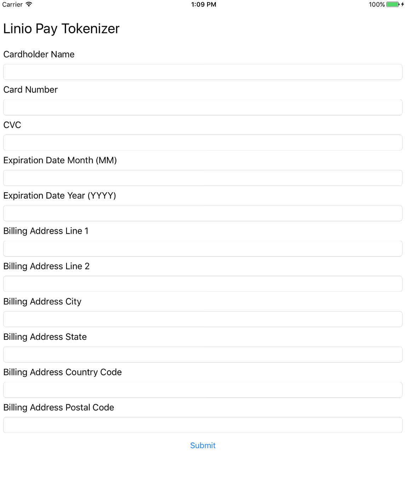

# Client Setup

## Introduction

LinioPay Tokenizer IOS SDK is the IOS interface to get customer’s credit card information in a secure way. 
The following guide will demonstrate how you can setup the SDK.

## Setup

This setup will be based on a typical payment form:


----------
**All submitted fields will be validated before and after requesting a token via the SDK and our API.**


### 1. Add LinioPay Tokenizer to your Podfile

```
pod 'LinioPayTokenizer', :git => 'git@github.com:LinioIT/pay-tokenizer-ios.git', :branch => 'master'
```

### 2. Install Pods

```
pod install
```

### 3. Import Library

```objectivec
#import <LinioPayTokenizer/LinioPayTokenizer.h>
```

### 4. Instantiate Tokenizer

Use your assigned merchant tokenization test and public keys respectively of your working environments to set the SDK credential key while initializing the tokenizer instance:

```objectivec
tokenizer = [[LinioPayTokenizer alloc] initWithKey:@"test_0618f5c21603cd9d33ba8a8f0c9e2446283"];
```

**They key will get validated before requesting a token. It will only accept valid key values define for test and production environments.**

### 5. Request and/or Create a Token

Request a credit card token once your payment is ready to be submitted via the LinioPayTokenizer requestToken method:

```objectivec
-(void)requestToken: (NSDictionary *)formValues completion: (void (^)(NSDictionary* data, NSError* error))completion
```

**The data dictionary `formValues` parameter should adhere to the following structure and expected keys defined by corresponding string constants:**

```objectivec
 @{
   FORM_DICT_KEY_NAME: nameField.text,
   FORM_DICT_KEY_NUMBER: numberField.text,
   FORM_DICT_KEY_CVC: cvcField.text,
   FORM_DICT_KEY_MONTH: monthField.text,
   FORM_DICT_KEY_YEAR: yearField.text,
   FORM_DICT_KEY_ADDRESS: @{
           FORM_DICT_KEY_STREET_1: addressLine1Field.text,
           FORM_DICT_KEY_STREET_2: addressLine2Field.text,
           FORM_DICT_KEY_CITY: addressCityField.text,
           FORM_DICT_KEY_STATE: addressStateField.text,
           FORM_DICT_KEY_COUNTRY_CODE: addressCountryCodeField.text,
           FORM_DICT_KEY_POSTAL_CODE: addressPostalCodeField.text,
           },
   }
```
**The `address` and it's child terms below are all optional, but if address key is present child dictionary object is required during validation:**

```objectivec
FORM_DICT_KEY_ADDRESS: @{
       FORM_DICT_KEY_STREET_1: addressLine1Field.text,
       FORM_DICT_KEY_STREET_2: addressLine2Field.text,
       FORM_DICT_KEY_CITY: addressCityField.text,
       FORM_DICT_KEY_STATE: addressStateField.text,
       FORM_DICT_KEY_COUNTRY_CODE: addressCountryCodeField.text,
       FORM_DICT_KEY_POSTAL_CODE: addressPostalCodeField.text,
       },
},

```

**The `street2` is always optional**

Following is a table describing each form field's validation criteria:
 
| Dictionary Costant | Dictionary Key | Description | Criteria |
| --- | --- | --- | --- |
| `FORM_DICT_KEY_NAME` | `cardholder` | Card holder full name | String, 5-60 characters |
| `FORM_DICT_KEY_NUMBER` | `number` | Credit card number | Valid credit card number string, 13-16 numeric characters |
| `FORM_DICT_KEY_MONTH` | `expiration_month` | Credit card expiration date 2 digits month | String, 2 numeric characters |
| `FORM_DICT_KEY_YEAR` | `expiration_year` | Credit card expiration date 4 digits year | String, 4 numeric characters |
| `FORM_DICT_KEY_STREET_1` | `street1` | Credit card billing address street 1st line | String, 255 characters maximum  |
| `FORM_DICT_KEY_STREET_2` | `street2` | Credit card billing address street __(optional)__ 2nd line | String, 255 characters maximum |
| `FORM_DICT_KEY_CITY` | `city` | Credit card billing address city | String, 255 characters maximum |
| `FORM_DICT_KEY_STATE` | `state` | Credit card billing address state | String, 120 characters maximum |
| `FORM_DICT_KEY_COUNTRY_CODE` | `country_code` | Credit card billing address 3 characters [ISO Alpha-3 Code](http://www.nationsonline.org/oneworld/country_code_list.htm) country code |  String, 3 characters |
| `FORM_DICT_KEY_POSTAL_CODE` | `postal_code` | Credit card billing address postal code |  String, 20 characters maximum |

The second `completion` parameter of the `requestToken` method is a callback function
that will process the API response as in:

```objectivec
completion: ^(NSDictionary *data, NSError *error)
{
    NSMutableString *message = [[NSMutableString alloc] init];
    if(error!=nil)
    {
        message = [NSMutableString stringWithFormat:@"%@", [error userInfo]];
    }
    else
    {
        message = [NSMutableString stringWithFormat:@"%@", data];
    }
		
	 // In this example we popup and alert with our API response	
    dispatch_async(dispatch_get_main_queue(),
    ^{
        UIAlertView *alert = [[UIAlertView alloc] initWithTitle:@"Tokenizer Response"
                                                        message:[NSString stringWithFormat:@"%@", message]
                                                       delegate:nil cancelButtonTitle:@"Dismiss"
                                              otherButtonTitles:nil];
        [alert show];
    });
}];
```

The `requestToken` response object will look like this:

```json
{
  "token_id": "dfc766de-ed6f-11e6-98d9-080027bccc63",
  "merchant_id": "bbdfd6f8-e22f-11e5-b067-acbc3296c9c9",
  "payment_method": {
    "charge_card": {
      "cardholder": "Luciano Araujo",
      "bin": "411111",
      "last_four": "1111",
      "expiration_month": "01",
      "expiration_year": "2020",
      "type": "CREDIT",
      "brand": "VISA"
    }
  },
  "uses": 0,
  "client_ip": "192.168.13.1",
  "test": true,
  "expiration": null,
  "created_at": "2017-02-07T19:59:03+00:00",
  "updated_at": "2017-02-07T19:59:03+00:00"
}
```

### 6. Process Payment

Use the above `token_id` response key value to replace the credit card metadata. 

You can now process this response and fully execute the rest of the pending transaction data to complete the payment process.
